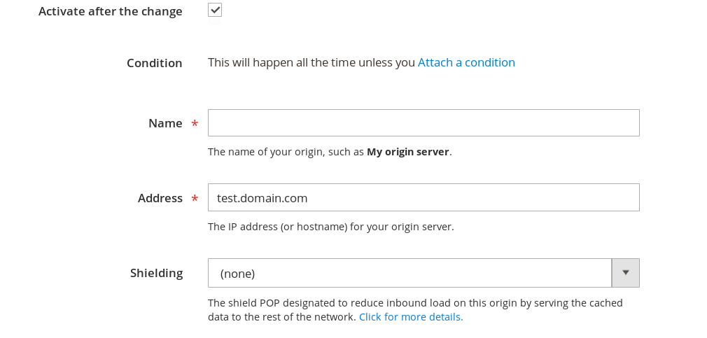
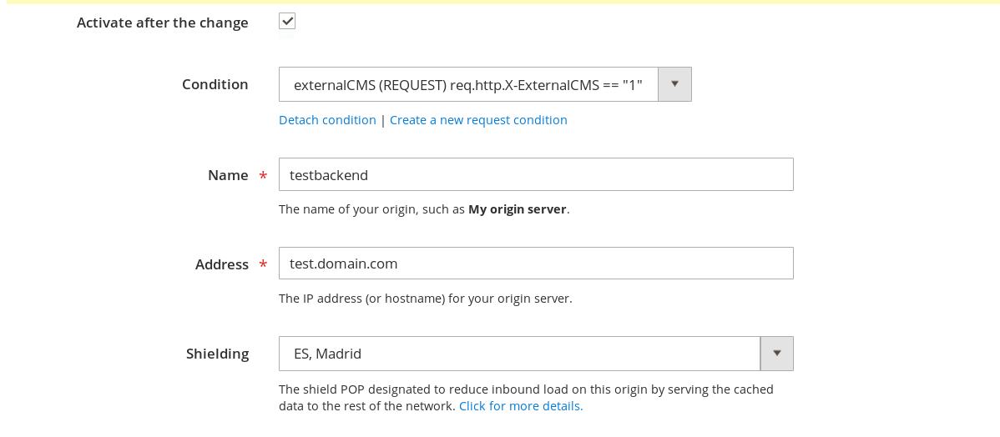
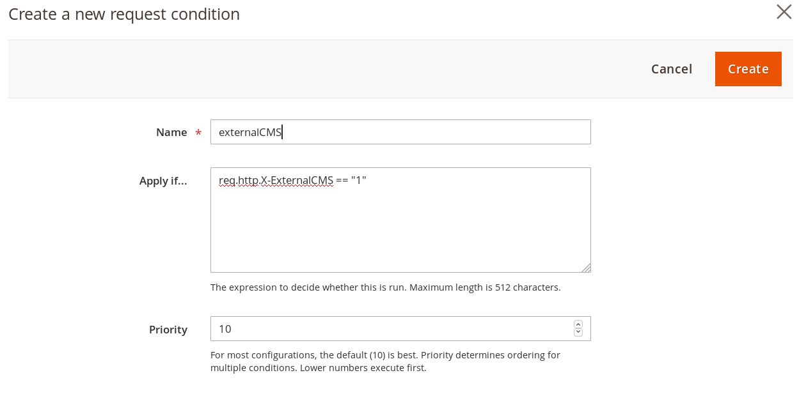
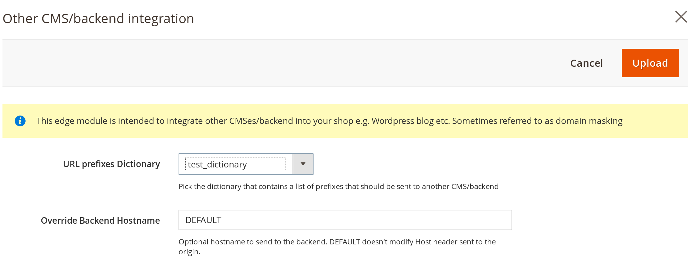

# Fastly Edge Modules - Other CMS/Backend integration

This guide will show you how to integrate another CMS/Backend into your Magento shop. It's intended for shops that want
to bring in certain URL prefixes into the shop e.g. /blog/, /about-us etc.

## Prerequisites

Before you can use Fastly Edge Modules you need to [make sure they are enabled](https://github.com/fastly/fastly-magento2/blob/master/Documentation/Guides/Edge-Modules/EDGE-MODULES.md)

1. You need to create an edge dictionary that will contain URL prefixes that will be routed to the other backend. All the prefixes
are intended to be only one level deep and *without preceding slash* e.g. if you want to bring in `/blog` you would add key `blog` with 
value 1. You can see an example [here](https://devdocs.magento.com/guides/v2.3/cloud/cdn/fastly-vcl-wordpress.html#edge-dictionary)

2. You will need create a backend in your Fastly service

- Add the other CMS host to the Fastly backend configuration, for example customer.example.com.
- Attach the following request condition to the backend.

```
req.http.X-ExternalCMS == "1"
```

You can create a backend in the Fastly configuration (available in 1.2.102+) by clicking 

```
Magento admin > Stores > Configuration > Advanced > System > Full Page Cache > Fastly Configuration > Backend Settings > Create
```

Enter the domain name or the IP of your backend. Then *Add a Backend* screen will pop up 



- Click *Attach a condition*



- Click on *Create a new Request Condition*

Fill out the form as follows



Apply if will be

```
req.http.X-ExternalCMS == "1"
```

Click Create to create the request condition then Create to create a backend. Once you are successful with 
adding a backend proceed to configuration.

*Please note* you should specify a shield location for your backend and it should be close to your origin e.g.
if your origin is in Netherlands pick our Amsterdam shield etc. Shield will greatly decrease the number of
requests hitting your origin and is required for Image Optimization. [Read more about origin shielding](https://docs.fastly.com/guides/performance-tuning/shielding). 

## Configuration

When you click on the configuration you will be prompted with a screen like this



## Configurable options

### URL prefixes dictionary

This is the name of the dictionary containing URL prefixes you want routed to the other backend e.g. `wordpress_urls`

### Override backend host name

By default Fastly forwards the hostname of your shop back to the backend. In most instances your other backend will not recognize
your shop name e.g. if you are using `blog.domain.com` for hosting your blog. If that is the case supply the hostname that should
be sent to your alternate backend.

## Enabling

After any change to the settings you need to click Upload as that will activate the functionality you configured.

## Technical details

Following VCL is being uploaded 

Snippet Type: vcl_recv

```
# Make sure X-ExternalCMS is not set before proceeding
  if ( req.restarts == 0 ) {
     remove req.http.X-ExternalCMS;
  }

  # Extract first part of the path from a URL
  if ( req.url.path ~ "^/?([^:/\s]+).*$" ) {
     # check if first part of the url is in the wordpress urls table
     if ( table.lookup(magentomodule_config, re.group.1, "NOTFOUND") != "NOTFOUND" ) {
       set req.http.X-ExternalCMS = "1";
       # There is an issue with load-scripts.php in Wordpress where the ordering of query arguments matter
       # in compressing the JS. By default Magento sorts query arguments. Here we undo the sorting for wp-admin URLs
       if ( req.url.path ~ "/wp-admin" ) {
         set req.url = req.http.Magento-Original-URL;
       }
     }
  }
```

If you enter override backend host this content will be added in both vcl_pass and vcl_miss

```
 if ( req.backend.is_origin && req.http.X-ExternalCMS ) {
    set bereq.http.host = "blog.domain.comoveride";
  }
```


## Extras

Ruby script that can be used to add a backend if you so choose.

```ruby
require 'net/http'
require 'uri'
require 'json'

# Enter your Fastly Key
FASTLYKEY="XXXXXXXXXXXXXXXXXXXX"
# Either IP or Hostname
BACKEND_HOST="127.0.0.1"
# If TLS leave 443 if not change to 80
BACKEND_PORT=443
# Change based on region ca-central1/us-east1/2 = dca-dc-us, eu-west1/2 = london-uk, ap-southeast-2 = sydney-au, us-west2 = sea-wa-us
BACKEND_SHIELD="dca-dc-us"

def fastlyAPICall(url, method = "GET", body = "")
  uri = URI(url)
  Net::HTTP.start(uri.host, uri.port, :use_ssl => true) do |http|
    if method == "GET"
        request = Net::HTTP::Get.new uri
    end
    if method == "POST"
        request = Net::HTTP::Post.new uri
        request.body = body
    end
    if method == "PUT"
        request = Net::HTTP::Put.new uri
    end
    request['Fastly-Key'] = FASTLYKEY
    response = http.request request # Net::HTTPResponse object
    return response.body
  end
end

# Get a list of services
puts "Getting service info"
services_info = JSON.parse(fastlyAPICall("https://api.fastly.com/services"))
active_version = services_info["data"][0]["attributes"]["active_version"]
service_id =  services_info["data"][0]["id"]
puts "Service #{service_id} current active version #{active_version}"

puts "Cloning active version"
url = "https://api.fastly.com/service/" + service_id.to_s + "/version/" + active_version.to_s + "/clone"
puts "Executing a PUT #{url}"
clone_info = JSON.parse(fastlyAPICall(url, "PUT"))
cloned_version = clone_info["number"]
puts "Service #{service_id} cloned version #{cloned_version}"

puts "Add External CMS condition"
payload="name=choose_externalcms_backend&statement=req.http.X-ExternalCMS == \"1\"&type=REQUEST&priority=10"
url = "https://api.fastly.com/service/" + service_id.to_s + "/version/" + cloned_version.to_s + "/condition"
puts "Executing a POST #{url} with payload #{payload}"
condition_add = JSON.parse(fastlyAPICall(url, "POST", payload))

puts "Add Backend #{BACKEND_HOST}:#{BACKEND_PORT}"
url = "https://api.fastly.com/service/" + service_id.to_s + "/version/" + cloned_version.to_s + "/backend"
payload = "name=external_cms&request_condition=choose_externalcms_backend&port=" + BACKEND_PORT.to_s + "&address=" + BACKEND_HOST.to_s + "shield=" + BACKEND_SHIELD.to_s)
backend_add = JSON.parse(fastlyAPICall(url, "POST", payload )

puts "Activating #{cloned_version} for service #{service_id}"
url = "https://api.fastly.com/service/" + service_id.to_s + "/version/" + cloned_version.to_s + "/activate"
activate_info = JSON.parse(fastlyAPICall(url, "PUT"))
puts activate_info
```
