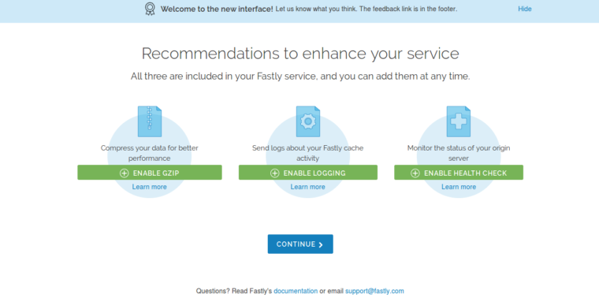
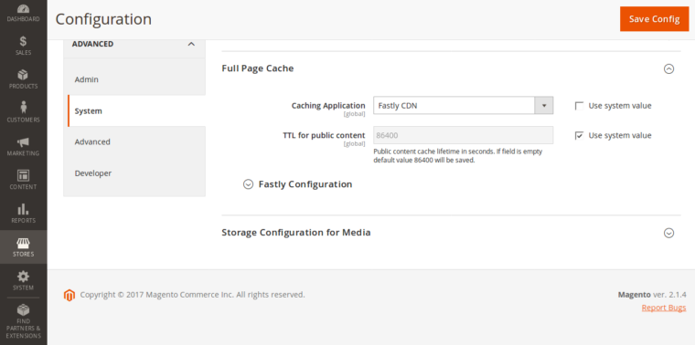
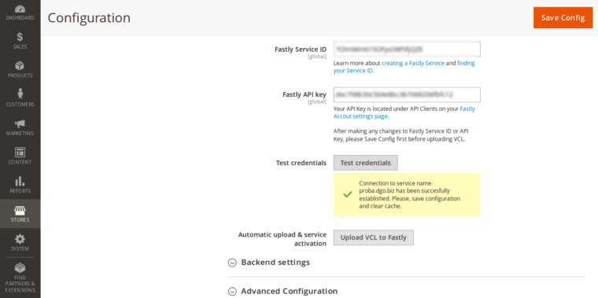
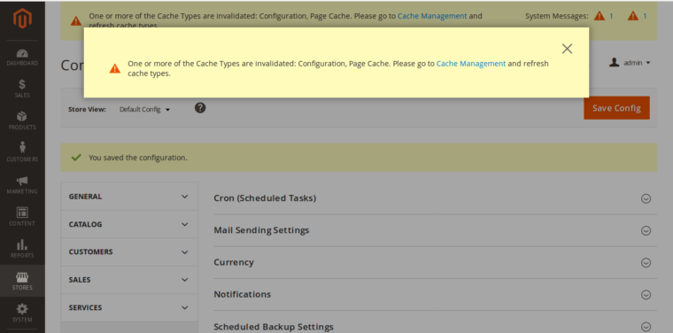
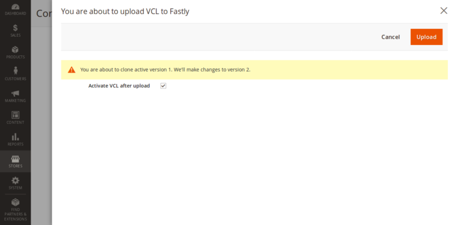
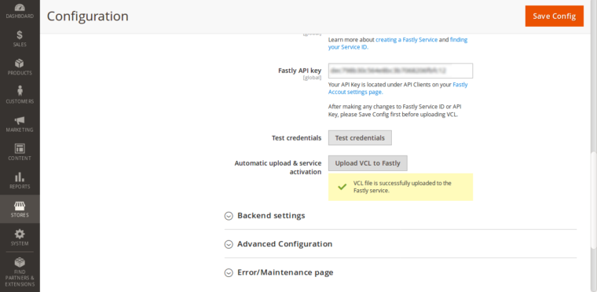

# Installation guide

This guide will show you how to install and configure Fastly CDN extension for Magento 2.

You may choose between three installation methods – composer installation, installation through the Magento Marketplace and manual installation by downloading the zip file.

We will use composer as installation method.

Open terminal \ console, go to your Magento installation directory and type these two commands in the following order:
```
composer config repositories.fastly-magento2 git "https://github.com/fastly/fastly-magento2.git"
```

Then:
```
composer require fastly/magento2
```

Once the installation is completed, enable the Fastly CDN module:
```
bin/magento module:enable Fastly_Cdn
```

Immediately after that, run the **setup:upgrade** command:
```
bin/magento setup:upgrade
```
And finally, clear the cache:
```
bin/magento cache:clean
```

You can read more detailed step by step instructions [here](../INSTALLATION.md).

That’s it, you have successfully installed the Fastly CDN extension. Let’s move to configuration.

###Configuration

In order to use the Fastly Cdn extension, you will have to [register a free Fastly account](https://www.fastly.com/signup).

Once you register and verify your account, login to Fastly:


You will see a welcome wizard with two input fields which you should fill with:

* Your website domain for Fastly to use when routing requests
* The hostname (or IP address) and port number for your origin server

On the next screen, Fastly is offering you to enable gzip, logging and health check of your origin – you can enable this later. Click continue.



On the final screen, you will have to **point your CNAME to Fastly.** Doing this, you will direct traffic from the Internet through Fastly instead of immediately through your store. You can read more here on how to achieve this.


Once you’ve finished with pointing your CNAME to Fastly, let’s configure Magento.

Login to you Magento admin and go to:
```
Stores > Configuration > Advanced > System
```

Under the **Full page cache** tab, untick the **Use system value** checkbox next to the **Caching Application** and choose **Fastly CDN.**



Click on Fastly Configuration tab and enter your **Fastly Service ID*** and **Fastly API key****.

**To find out you Service ID, login to the Fastly dashboard, locate your **Service name** and click on the **Show Service ID** link.*


***To find out your API key, while in the Fastly dashboard, select **Account** from the user menu and scroll way down to the bottom of the page. In the **Account API Key** area, click the **Show** button.*


You can press the **Test credentials** button just to make sure that you have entered valid credentials.



If you have received a success message, press the **Save Config** button and clear cache by going to System > Cache Management.



Once you have cleared the cache, go back to Stores > Configuration > Advanced > System and click on the **Fastly Configuration.** The final step is to upload the **VCL to Fastly.** You can do this by pressing the **Upload VCL to Fastly** button.

The modal window will pop up, make sure that the **Activate VCL after upload** is ticked and press the **Upload** button in the top right corner:



Once the upload process is done, the modal window will automatically close and the success message will show:



That’s it, you have successfully configured your Magento store with the Fastly CDN.

That’s it, you have successfully configured your Magento store with the Fastly CDN.

### Advanced configuration

You can configure Advanced options by clicking the Advanced Configuration tab under the Fastly configuration. You have a detailed description under every option – read it and configure it according to your needs.

You can read more about advanced configuration [here](../CONFIGURATION.md#further-configuration-options).

### Purging

You can purge Fastly CDN content through the Magento admin by going to System > Cache Management. You can purge content by the following options:

* Purge by content type
* Purge by store
* Purge a URL
* Purge all

You can read more about purging [here](../OTHER-FUNCTIONS.md#purging).

